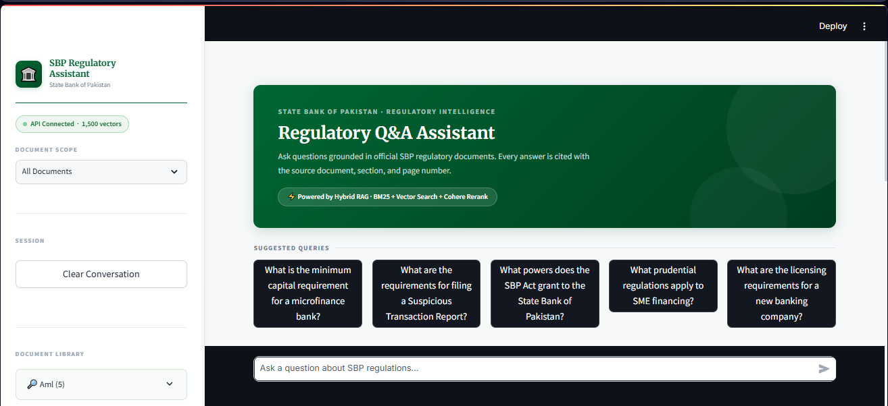
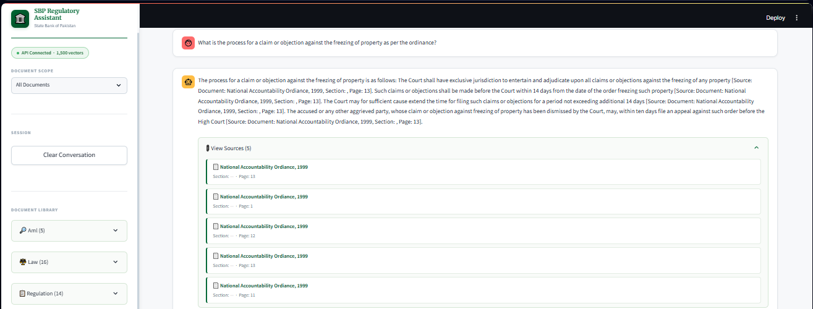
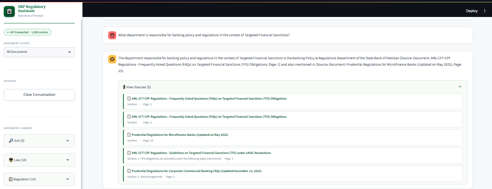

# SBP Regulatory RAG Assistant

A production-grade **Retrieval-Augmented Generation (RAG)** system built over 42 State Bank of Pakistan (SBP) regulatory PDFs. Given a natural-language question, the system retrieves the most relevant regulatory passages and generates a grounded, cited answer — strictly from official SBP documents.

---

## 📸 Application Screenshots

### Landing Page


### Conversation Log 1


### Conversation Log 2


---

## Table of Contents

1. [Architecture Overview](#architecture-overview)
2. [Pipeline Deep Dive](#pipeline-deep-dive)
   - [Phase 1 — Document Ingestion: PDF Parsing](#phase-1--document-ingestion-pdf-parsing)
   - [Phase 2 — Chunking](#phase-2--chunking)
   - [Phase 3 — Embedding & Qdrant Ingestion](#phase-3--embedding--qdrant-ingestion)
   - [Phase 4 — Query Time: Hybrid Retrieval](#phase-4--query-time-hybrid-retrieval)
   - [Phase 5 — Answer Generation](#phase-5--answer-generation)
3. [RAGAS Evaluation](#ragas-evaluation)
4. [Project Structure](#project-structure)
5. [Prerequisites](#prerequisites)
6. [Setup & Run Order](#setup--run-order)
7. [Configuration Reference](#configuration-reference)
8. [Important Constraints](#important-constraints)

---

## Architecture Overview

```
┌─────────────────────────────────────────────────────────────────┐
│                        INGESTION  (offline, one-time)           │
│                                                                  │
│  42 SBP PDFs  ──▶  PDF Parser  ──▶  Chunker  ──▶  Embedder     │
│   (laws,              (pdfplumber      (LlamaIndex    (all-mpnet  │
│   regulations,         + Tesseract)     SentenceSplit)  -base-v2) │
│   AML/CFT)                                    │                  │
│                                               ▼                  │
│                                    Qdrant (local-path)           │
│                              ┌─────────────────────────┐         │
│                              │  sbp_laws               │         │
│                              │  sbp_regulations        │         │
│                              │  sbp_aml                │         │
│                              └─────────────────────────┘         │
└─────────────────────────────────────────────────────────────────┘

┌─────────────────────────────────────────────────────────────────┐
│                        QUERY  (real-time)                        │
│                                                                  │
│  User Question                                                   │
│      │                                                           │
│      ▼                                                           │
│  Streamlit UI  ──HTTP──▶  FastAPI  /query                        │
│                               │                                  │
│                    ┌──────────▼──────────┐                       │
│                    │  Query Classifier    │  (keyword routing)   │
│                    └──────────┬──────────┘                       │
│                               │                                  │
│              ┌────────────────┼────────────────┐                 │
│              ▼                                 ▼                 │
│         BM25 Search                    Vector Search             │
│       (rank_bm25,                   (Qdrant cosine,             │
│        top-20)                       all-mpnet-base-v2, top-20)  │
│              │                                 │                 │
│              └────────────┬────────────────────┘                 │
│                           ▼                                      │
│                  Reciprocal Rank Fusion                          │
│                   (RRF, k=60, top-20)                            │
│                           │                                      │
│                           ▼                                      │
│                  Cohere Reranker v3.5                            │
│                      (top-5 final)                               │
│                           │                                      │
│                           ▼                                      │
│                  Groq LLM (llama-3.3-70b-versatile)             │
│               + Strict Regulatory System Prompt                  │
│                           │                                      │
│                           ▼                                      │
│               Cited Answer + Source References                   │
└─────────────────────────────────────────────────────────────────┘
```

---

## Pipeline Deep Dive

### Phase 1 — Document Ingestion: PDF Parsing

**Script:** `src/ingestion/pdf_parser.py`

The parser processes all 42 PDFs found recursively under `data/`, writing one JSON object per page to `data/processed/raw_pages.jsonl`.

#### Step 1a — Metadata Inference
Before any text is extracted, the file system path is inspected to assign `doc_type` and `category` labels to every page. These labels determine which Qdrant collection the page's chunks will be stored in:

| Path pattern | `doc_type` | `category` | Qdrant collection |
|---|---|---|---|
| `data/laws/` | `law` | `law` | `sbp_laws` |
| `data/regulations/prudential*/` | `regulation` | `prudential` | `sbp_regulations` |
| `data/regulations/AML-CFT-CPF*/` | `aml` | `aml` | `sbp_aml` |
| `data/regulations/other*/` | `regulation` | `other` | `sbp_regulations` |
| `data/notifications/` | `regulation` | `notification` | `sbp_regulations` |

#### Step 1b — PDF Triage (Digital vs. Scanned)
Each PDF is triaged by sampling its first 3 pages with `pdfplumber`. If the combined extractable text exceeds 150 characters, the PDF is classified as **digital** (it has a real text layer). Below that threshold it is classified as **scanned** (the pages are rasterised images).

#### Step 1c — Digital PDF Parsing (pdfplumber)
For digital PDFs, every page is processed individually:
1. **Prose text** is extracted with `pdfplumber`'s `extract_text()`.
2. **Tables** are extracted with `extract_tables()` and converted to pipe-delimited text rows (`cell1 | cell2 | ...`), then appended to the prose block under a `[TABLE]` marker.
3. Pages yielding fewer than 50 characters after stripping are discarded (blank pages, decorative covers).

#### Step 1d — Scanned PDF Parsing (Tesseract OCR)
For scanned PDFs, the `unstructured` library is used with `strategy="ocr_only"`:
1. Each page is converted to a PNG image (requires Poppler's `pdfinfo` on PATH).
2. Tesseract OCR (English language) extracts text from each image.
3. `unstructured` elements are grouped by page number and joined.
4. If OCR fails for any reason, the parser falls back to `pdfplumber` (which may still recover partial text from a semi-digital PDF).

#### Output
`data/processed/raw_pages.jsonl` — one JSON line per page:
```json
{
  "text": "Section 5 – Capital Requirements\nA banking company shall...",
  "metadata": {
    "source_file": "Prudential_Regulations_Corporate",
    "doc_type": "regulation",
    "category": "prudential",
    "file_path": "E:/.../.pdf",
    "page": 12
  }
}
```

---

### Phase 2 — Chunking

**Script:** `src/ingestion/chunker.py`

Raw pages are often too long to pass directly to an LLM or embed meaningfully as single units. The chunker splits each page into smaller, overlapping, sentence-aware pieces.

#### Step 2a — Section Header Extraction
Before splitting, the first 10 lines of each page are scanned for a legal section header using a set of regex patterns specific to SBP document conventions:

| Pattern | Example |
|---|---|
| `^(PR\|R\|M\|O\|G)-\d+.*` | `PR-1`, `M-3` (Pakistani regulation codes) |
| `^Regulation\s+\d+.*` | `Regulation 5 – Capital Requirements` |
| `^Section\s+\d+[\.\d]*.*` | `Section 17`, `Section 3.2` |
| `^Article\s+\d+.*` | `Article 12 – Definitions` |
| `^CHAPTER\s+[IVXLCDM]+.*` | `CHAPTER IV` |
| `^PART\s+[IVXLCDM]+.*` | `PART III` |
| `^\d+\.\s+[A-Z].*` | `3. Definitions and Scope` |

The matched header is **prepended to every child chunk** generated from that page. This ensures that even if the retriever returns only a small passage from the middle of a section, the chunk still carries the section label — maintaining citation accuracy.

#### Step 2b — Sentence-Aware Splitting (LlamaIndex SentenceSplitter)
Each page (with prepended header) is split using LlamaIndex's `SentenceSplitter`, configured from `config/config.yaml`:

| Parameter | Value | Meaning |
|---|---|---|
| `chunk_size` | 512 tokens | Maximum chunk length |
| `chunk_overlap` | 64 tokens | Overlap between consecutive chunks |
| `min_chunk_length` | 100 chars | Minimum to keep (filters noise) |

`SentenceSplitter` respects sentence boundaries — it will never cut mid-sentence to satisfy the token limit. If a single sentence exceeds `chunk_size`, it is kept as-is.

#### Step 2c — Filtering
Any chunk with fewer than 100 characters is discarded. These are typically navigation artefacts: page numbers, single-line headers, or table-of-contents entries that carry no informational value for retrieval.

#### Output
`data/processed/chunks.jsonl` — one JSON line per chunk:
```json
{
  "text": "Regulation 5 – Capital Requirements\nA banking company shall maintain...",
  "metadata": {
    "source_file": "Prudential_Regulations_Corporate",
    "doc_type": "regulation",
    "category": "prudential",
    "page": 12,
    "section_header": "Regulation 5 – Capital Requirements",
    "chunk_index": 0,
    "char_count": 487
  }
}
```

---

### Phase 3 — Embedding & Qdrant Ingestion

**Script:** `src/ingestion/embedder.py`

#### Step 3a — Embedding Model
The embedding model is **`all-mpnet-base-v2`** from `sentence-transformers`, running entirely **locally** — no API key, no rate limits, no internet dependency after the first download.

| Property | Value |
|---|---|
| Model | `all-mpnet-base-v2` |
| Embedding dimensions | 768 |
| Similarity metric | Cosine |
| Batch size | 64 chunks per `.encode()` call |
| Download size | ~420 MB (cached at `~/.cache/huggingface/hub/`) |

The model is loaded as a module-level singleton — it is loaded once at API startup and reused for every query without reloading. This keeps query latency low.

#### Step 3b — Qdrant Collections
Qdrant runs in **local-path mode** (`E:/qdrant_storage`). Three collections are created, one per document domain. Each point in a collection stores:
- A 768-dimensional float vector (the chunk embedding)
- A payload with `text`, `source_file`, `doc_type`, `category`, `page`, `section_header`, `chunk_index`

| Collection | Documents |
|---|---|
| `sbp_laws` | SBP Act, Banking Companies Ordinance, Credit Bureau Act, Foreign Exchange Regulation Act, Microfinance Institutions Ordinance, Financial Institutions (Recovery of Finances) Ordinance, NAB Ordinance, Pakistan Coinage Act, and others (19 PDFs) |
| `sbp_regulations` | Prudential Regulations for Corporate/Commercial Banks, SME Financing, Housing Finance, Microfinance Banks; Other Regulations; Notifications (18 PDFs) |
| `sbp_aml` | AML/CFT/CPF Regulations, Targeted Financial Sanctions Guidelines, Risk-Based Approach documents (5 PDFs) |

#### Step 3c — Upsert Process
For each chunk:
1. A UUID is generated as the Qdrant point ID.
2. The chunk text is embedded to a 768-dim vector.
3. A `PointStruct` is constructed with the vector and the full metadata payload.
4. Points are upserted in batches to Qdrant.

> **Note:** Qdrant runs in local-path mode which allows only one process at a time. Do **not** run the embedder while the API is running.

---

### Phase 4 — Query Time: Hybrid Retrieval

**Script:** `src/retrieval/retriever.py`

Every user question goes through a four-stage retrieval pipeline. BM25 and vector search run **in parallel** via `ThreadPoolExecutor`, then their results are merged and re-ranked.

#### Step 4a — Query Classification (Collection Routing)
Before searching, the query is classified by keyword matching to route it to the most relevant Qdrant collection(s):

| Keywords detected | Collections searched |
|---|---|
| AML/CFT/KYC/PEP/sanctions/money laundering/etc. | `sbp_aml` only |
| SBP Act/Banking Companies Ordinance/specific law names | `sbp_laws` only |
| No strong signal (general regulatory question) | All three collections |

This avoids wasting retrieval budget on irrelevant domains and keeps results domain-focused.

#### Step 4b — BM25 Keyword Search
An in-memory **BM25Okapi** index is built from `chunks.jsonl` at API startup using `rank_bm25`. The tokenised corpus is held in RAM for zero-latency lookups.

For each query:
1. The query is lower-cased and whitespace-tokenised.
2. BM25 scores are computed for every chunk in the corpus.
3. The top-20 highest-scoring chunks are returned with their ranks and scores.

BM25 excels at exact keyword and phrase matching (regulation codes, specific thresholds, numeric values).

#### Step 4c — Dense Vector Search (Qdrant)
Simultaneously:
1. The query is embedded with `all-mpnet-base-v2` (the same model used at ingest time) to produce a 768-dim query vector.
2. Qdrant's `search()` is called on each selected collection with `limit=20`.
3. Results from all searched collections are merged and sorted by descending cosine similarity score.
4. The top-20 results are returned.

Dense vector search excels at semantic similarity — finding passages that express the same concept in different words.

#### Step 4d — Reciprocal Rank Fusion (RRF)
The two ranked lists (BM25 top-20 and vector top-20) are merged using **Reciprocal Rank Fusion**:

```
RRF_score(chunk) = Σ  1 / (k + rank_in_list)
                  lists
```

Where `k = 60` (the smoothing constant — reduces the dominance of rank-1 items). Each chunk's text prefix (first 100 characters) serves as the deduplication key, so chunks appearing in both lists receive the sum of their per-list scores. The merged list is sorted by descending RRF score and truncated to 20 candidates.

RRF consistently outperforms either search method alone because it rewards chunks that are both lexically relevant (BM25) and semantically relevant (vector).

#### Step 4e — Cohere Reranking
The 20 RRF candidates are passed to **Cohere `rerank-v3.5`**, a cross-encoder model trained for relevance scoring. Unlike bi-encoders (which embed query and document independently), a cross-encoder reads the query and document together — producing more accurate relevance scores at the cost of higher latency.

- Cohere re-scores all 20 candidates for the specific query.
- The top-5 by `relevance_score` are returned as the final context.
- **Graceful fallback:** If Cohere's trial key is rate-limited (5 RPM / 1000 calls per month), the pipeline falls back to the top-5 from the RRF list, preserving functionality.

#### Final Output
5 ranked chunks, each carrying:
- `text` — the actual regulatory passage
- `metadata.source_file` — which PDF it came from
- `metadata.section_header` — which section of that document
- `metadata.page` — the page number
- `rerank_score` — Cohere's relevance score (when available)

---

### Phase 5 — Answer Generation

**Script:** `src/generation/rag_chain.py` | **API:** `api/main.py`

#### Step 5a — Context Formatting
The 5 retrieved chunks are formatted into a numbered context block:

```
[1] Document: Prudential_Regulations_SME | Section: Regulation 5 | Page: 12
<chunk text>
---

[2] Document: Banking_Companies_Ordinance | Section: Section 17 | Page: 8
<chunk text>
---
...
```

The numbered format allows the LLM to cite specific chunks by index in its response.

#### Step 5b — System Prompt
The LLM operates under a strict system prompt that enforces grounded, citation-backed answers:

1. Answer **only** from the provided context — no external knowledge.
2. Cite every factual claim with `[Source: <file>, Section: <section>, Page: <page>]`.
3. If the context is insufficient, respond exactly: *"I cannot find this in the provided regulatory documents."*
4. Never invent, estimate, or extrapolate regulatory requirements.
5. Never provide legal advice beyond what is literally stated.

#### Step 5c — LLM Call (Groq)
The formatted context + user question are sent to **Groq's API** with model `llama-3.3-70b-versatile`:

| Parameter | Value |
|---|---|
| Model | `llama-3.3-70b-versatile` |
| `max_tokens` | 1024 |
| `temperature` | 0.1 (near-deterministic for regulatory accuracy) |
| Rate limit handling | Tenacity retry: 2 attempts, 3–10s exponential back-off |
| Streaming | Supported via `get_answer_streaming()` for the Streamlit UI |

The low temperature minimises hallucination risk — the model is strongly biased toward reproducing the exact language of the retrieved passages rather than paraphrasing creatively.

#### Step 5d — Response Structure
The API returns:
```json
{
  "question": "What is the minimum capital requirement for SME financing?",
  "answer": "According to Regulation 5... [Source: Prudential_Regulations_SME, Section: Regulation 5, Page: 12]",
  "sources": [
    {"document": "Prudential_Regulations_SME", "section": "Regulation 5", "page": 12},
    ...
  ]
}
```

The Streamlit UI renders the answer as markdown and displays source cards below each response, showing document name, section, and page number.

---

## RAGAS Evaluation

**Script:** `src/evaluation/evaluator.py`

The system is evaluated using [RAGAS](https://docs.ragas.io/) — a framework for automated RAG evaluation that uses an LLM-as-judge to score retrieval and generation quality without requiring human annotations.

### Evaluation Dataset

144 question–ground-truth pairs (`evals/eval_pairs.json`) are generated automatically from the chunk corpus using Gemini Flash. Each pair is sampled from a randomly selected chunk, with the chunk's text used to generate a factual question and its corresponding ground-truth answer. The pairs are stratified across all three document domains (`law`, `regulation`, `aml`).

### How RAGAS Works — Step by Step

The evaluator collects data for each of the 144 questions by calling the live API:

1. **Context retrieval** — the `/retrieve` endpoint is called (bypasses the LLM entirely, returns raw chunks from the hybrid retrieval pipeline).
2. **Answer generation** — the question + retrieved chunks are sent to the Groq LLM to produce an answer.
3. A dataset row is formed: `(question, answer, contexts[], ground_truth)`.

All 144 rows are saved to `evals/eval_checkpoint.json` immediately after collection, so if scoring fails (e.g. due to API rate limits), it can be re-run independently with `--score` without repeating the API calls.

### RAGAS Metrics

RAGAS uses a **judge LLM** (`gemini-2.5-flash`) to score each row on four metrics:

| Metric | What it measures | How it is computed |
|---|---|---|
| **Faithfulness** | Does the answer contain only claims that are grounded in the retrieved context? | Judge LLM identifies each claim in the answer, then checks whether each claim is inferable from the context. Score = claims supported / total claims. |
| **Answer Relevancy** | Does the answer actually address the question asked? | Judge LLM generates hypothetical questions from the answer and computes the mean cosine similarity between those questions and the original question. |
| **Context Precision** | Are the retrieved chunks actually relevant to the question? | Judge LLM scores each retrieved chunk as relevant or not (given the ground truth). Score = fraction of relevant chunks. |
| **Context Recall** | Does the retrieved context cover all the information needed to answer the question? | Judge LLM checks whether every statement in the ground-truth answer can be attributed to at least one retrieved chunk. |

All four metrics produce scores in `[0, 1]` — higher is better.

### Rate-Limiting Architecture

The free-tier Gemini judge is limited to 5 requests per minute per model. The evaluation engine enforces this with a thread-safe rate limiter built into the `_GeminiNoTemp` wrapper class:

- A class-level `threading.Lock` + timestamp enforce a minimum 13-second gap between consecutive judge calls.
- `max_workers=1` in RAGAS's `RunConfig` ensures serial execution — no parallel 429 storms.
- Scoring is run on a **50-row subsample** of the 144-row checkpoint (50 × 4 metrics = 200 judge calls ≈ 44 minutes).

### Running the Evaluation

```bash
# Step 1 — Generate 144 question/ground-truth pairs (one-time)
python src/evaluation/evaluator.py --generate

# Step 2 — Collect answers from the live API (saves checkpoint, ~20 min)
python src/evaluation/evaluator.py --eval

# Step 3 — Run RAGAS scoring from the checkpoint (no API re-collection, ~44 min)
python src/evaluation/evaluator.py --score

# Step 4 — Ablation study (compares doc-type scopes)
python src/evaluation/evaluator.py --ablate
```

> **Note:** `--score` can be re-run as many times as needed (e.g. after changing the judge model or fixing API limits) without repeating the expensive data collection step.

### Evaluation Results

> 🕐 **Evaluation is currently in progress.** RAGAS scoring requires ~44 minutes under the free-tier API rate limits. Metric results will be added here once the run completes.

| Metric | Score |
|---|---|
| Faithfulness | *pending* |
| Answer Relevancy | *pending* |
| Context Precision | *pending* |
| Context Recall | *pending* |

---

## Project Structure

```
sbp_rag/
├── api/
│   ├── main.py             ← FastAPI app: /query, /retrieve, /health endpoints
│   └── run.py              ← Uvicorn entry point
├── config/
│   └── config.yaml         ← All tunable parameters (chunking, retrieval, LLM, eval)
├── data/
│   ├── laws/               ← 19 PDFs: SBP Act, ordinances, etc.
│   ├── regulations/
│   │   ├── prudential regulations/    (11 PDFs)
│   │   ├── AML-CFT-CPF regulations/  (5 PDFs)
│   │   └── other regulations/        (6 PDFs)
│   ├── notifications/      ← 1 PDF
│   └── processed/          ← Generated: raw_pages.jsonl, chunks.jsonl
├── evals/
│   ├── eval_pairs.json     ← 144 question/ground-truth pairs
│   ├── eval_checkpoint.json← Collected answers (cached, gitignored)
│   └── results/            ← RAGAS scoring outputs (JSON + CSV)
├── logs/                   ← Loguru rotating log files (gitignored)
├── src/
│   ├── ingestion/
│   │   ├── pdf_parser.py   ← Triage → pdfplumber / Tesseract OCR → raw_pages.jsonl
│   │   ├── chunker.py      ← SentenceSplitter → chunks.jsonl
│   │   └── embedder.py     ← all-mpnet-base-v2 → Qdrant upsert
│   ├── retrieval/
│   │   └── retriever.py    ← BM25 + Vector → RRF → Cohere rerank
│   ├── generation/
│   │   └── rag_chain.py    ← Context format → Groq LLM → cited answer
│   ├── evaluation/
│   │   └── evaluator.py    ← RAGAS pipeline (generate/eval/score/ablate)
│   └── utils/
│       └── config.py       ← load_config() helper
├── tests/
│   └── test_retrieval.py   ← Pytest retrieval smoke tests
├── ui/
│   └── app.py              ← Streamlit chat interface with source cards
├── .env                    ← API keys (never committed)
├── .env.example            ← Template for .env
├── .gitignore
└── requirements.txt
```

---

## Prerequisites

### 1. Python 3.11
```bash
python --version   # must be 3.11.x
```

### 2. Tesseract OCR (required for scanned PDFs)
Download the Windows installer from:
https://github.com/UB-Mannheim/tesseract/wiki

During installation, **check "Add Tesseract to system PATH"**.

Verify:
```bash
tesseract --version
```

### 3. Poppler (required by unstructured for PDF→image conversion)
1. Download Windows binaries: https://github.com/oschwartz10612/poppler-windows/releases
2. Extract to `C:\poppler`
3. Add `C:\poppler\Library\bin` to your system PATH

Verify:
```bash
pdftotext -v
```

### 4. API Keys
Copy `.env.example` to `.env` and fill in your keys:
```bash
copy .env.example .env
```
| Key | Source | Used for |
|---|---|---|
| `GEMINI_API_KEY` | https://aistudio.google.com/apikey | RAGAS judge LLM |
| `GROQ_API_KEY` | https://console.groq.com/keys | Answer generation (llama-3.3-70b) |
| `COHERE_API_KEY` | https://dashboard.cohere.com/api-keys | Reranker (rerank-v3.5) |

---

## Setup & Run Order

```bash
# Create and activate virtual environment
python -m venv venv
venv\Scripts\activate        # Windows PowerShell

# Install all dependencies
pip install -r requirements.txt

# Phase 1 — Parse all 42 PDFs → raw_pages.jsonl
python src/ingestion/pdf_parser.py

# Phase 2 — Chunk pages → chunks.jsonl
python src/ingestion/chunker.py

# Phase 3 — Embed chunks and ingest into Qdrant
python src/ingestion/embedder.py

# Phase 4 — Run retrieval smoke tests
pytest tests/test_retrieval.py -v

# Phase 5 — Start the API backend (keep this terminal open)
python api/run.py

# Phase 6 — Start the UI (in a separate terminal)
streamlit run ui/app.py

# Phase 7 — Generate eval pairs and run RAGAS evaluation
python src/evaluation/evaluator.py --generate
python src/evaluation/evaluator.py --eval
python src/evaluation/evaluator.py --score
python src/evaluation/evaluator.py --ablate
```

---

## Configuration Reference

`config/config.yaml` controls all tunable parameters:

```yaml
embedding:
  model: "all-mpnet-base-v2"   # sentence-transformers model, 768-dim, runs locally
  dimensions: 768
  batch_size: 64

chunking:
  chunk_size: 512              # tokens per chunk (SentenceSplitter)
  chunk_overlap: 64            # overlap between consecutive chunks
  min_chunk_length: 100        # minimum characters to keep a chunk

retrieval:
  bm25_top_k: 20              # BM25 candidates before RRF
  vector_top_k: 20            # Vector search candidates before RRF
  rerank_top_n: 5             # Final chunks passed to the LLM
  rrf_k: 60                   # RRF smoothing constant

qdrant:
  path: "E:/qdrant_storage"
  collections:
    laws: "sbp_laws"
    regulations: "sbp_regulations"
    aml: "sbp_aml"

llm:
  model: "llama-3.3-70b-versatile"
  max_tokens: 1024
  temperature: 0.1

evaluation:
  n_eval_pairs: 50
  judge_model: "gemini-2.5-flash"
  metrics:
    - faithfulness
    - answer_relevancy
    - context_precision
    - context_recall
```

---

## Important Constraints

| Constraint | Detail |
|---|---|
| **Qdrant single-process** | Qdrant in local-path mode allows only one process. Never run ingestion (`embedder.py`) while the API is running. Do not launch uvicorn with `--workers > 1`. |
| **Gemini free tier** | 5–20 requests per day depending on model. The RAGAS evaluator has a built-in 13s rate limiter to respect the 5 RPM cap. |
| **Groq free tier** | 30 RPM / varies by model TPD. The UI shows a rate-limit warning if the LLM is temporarily unavailable. |
| **Cohere trial** | 5 RPM / 1000 calls per month. The reranker falls back to RRF top-5 automatically on rate-limit errors. |
| **Eval checkpoint** | `evals/eval_checkpoint.json` caches the 144 collected answers. Delete it only when you want to force a fresh data collection run. |
